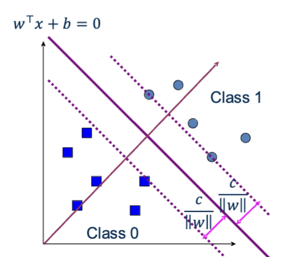
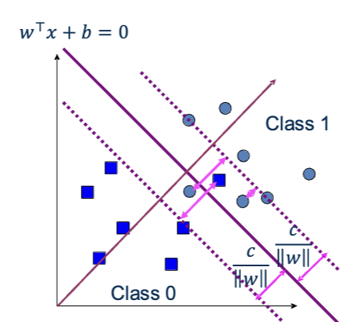

# Lecture 8 - Support Vector Machines

These notes cover Hard Margin SVM, Soft Margin SVM, Lagrangian Duality, KKT Conditions, and Hard Margin SVM Dual Problem. They correspond to slides 1-19 of lecture 8.

## Notation

- $x^i$: the $i$-th data point
- $y^i \in \{-1, +1\}$: the label of $x^i$ (class 1 is $+1$, class 0 is $-1$)
- $n$: the number of data points
- $w$: weight vector
- $b$: bias
- $\lVert w \rVert$: length of $w$
- $\xi^i$: slack variables
- $C$: regularization parameter that sets how much each exception costs (not the same as the lowercase $c$ in the slide pictures)

## Hard Margin SVM
Imagine that you have a scatterplot containing two classes of data points. If the two classes can be cleanly seperated by drawing a boundary line (or a hyperplane in higher dimensions) between them, then you can use Hard Margin SVM to choose this boundary line. There are usually a lot of lines that you could potentially choose to seperate the data, so SVM gives you the rule for choosing the best one.

SVM chooses the boundary that gives the widest gap between the different classes. The full width of the gap is $2 / \lVert w \rVert$. On each side of the boundary line, there is a gap of $1 / \lVert w \rVert$ between the boundary line and the nearest point in that class. This means that maximizing the width of the gap means minimizing $\frac{1}{2}\lVert w \rVert^2$. 

(In the slides, the gap on each side is $c / \lVert w \rVert$. Multiplying $w$ and $b$ by the same number doesn't change the line, so we can scale them so that $c = 1$.)

From this, you get the Hard Margin optimization problem: 

$$
\begin{aligned}
\min_{w,\,b} \quad & \tfrac12 \lVert w \rVert^2 \\
\text{s.t.} \quad & y^i (w^\top x^i + b) \ge 1 \quad \text{for all } i
\end{aligned}
$$

The objective makes the gap as wide as possible. The constraint is that all of the data points must be on the correct side of the boundary line according to their class and must be outside of the gap.

If the gap is narrow, new points are more likely to accidently fall on the wrong side of the boundary line and be misclassified. Therefore, having a wider gap is better for generalization.

You can classify new points by checking which side of the line it is on. 

*Hard Margin SVM. Figure from the Lecture 8 slides (slide 3), K. Wang, CSE 6740.*

The decision boundary (line) is every point $x$ where $w^\top x + b = 0$. The weight vector $w$ is a vector that is perpendicular to the boundary line and sets the angle of the line. The bias $b$ shifts the line.

To classify a point, you can compute $w^\top x + b$. If the result is positive, the point falls in class +1 (also called class 1). If the result is negative, the point falls in class -1 (also called class 0). 

The decision boundary has margin boundaries, which are parallel lines on each side of the boundary line. The margin boundaries pass through the nearest data point on each side of the line.

- The margin boundary for class -1 is $w^\top x + b = -1$

- The margin boundary for class +1 is $w^\top x + b = 1$

$$y(w^\top x + b)$$

You can use the expression above to check whether a point is classified correctly. For class -1, $y=-1$, and for class +1, $y = 1$. If the point is in the correct class, the expression will be positive. If it is negative, the point is classified incorrectly.

### Support Vectors
The support vectors are points that fall exactly on the margin boundaries. If any of the support vectors move, the boundary line will move.

## Soft Margin SVM
Oftentimes, data points are intermixed, and drawing a boundary line between classes would leave some points misclassified. In situations where data is not linearly separable, Hard Margin SVM cannot be applied.

*Soft Margin SVM. Figure from the Lecture 8 slides (slides 4-6), K. Wang, CSE 6740.*

In these cases, you would need to apply Soft Margin SVM, which is basically Hard Margin SVM except it allows for exceptions.

With Soft Margin SVM, the point classification expression becomes:

$$y^i(w^\top x^i + b) \ge 1 - \xi^i, \qquad \xi^i \ge 0$$

$\xi^i$ represents exceptions, also called slack variables, which meanusre how far a point goes beyond the margin boundary. 

- If $\xi^i = 0$, the point falls cleanly within its correct class.
- If $0 < \xi^i < 1$, the point falls in its correct class, but it falls within the margin boundary. 
- If $\xi^i > 1$, the point falls on the wrong side of the boundary line and is misclassified.

$$
\begin{aligned}
\min_{w,\,b,\,\xi} \quad & \tfrac12 \lVert w \rVert^2 + C\sum_{i=1}^n \xi^i \\
\text{s.t.} \quad & y^i(w^\top x^i + b) \ge 1 - \xi^i, \quad \xi^i \ge 0 \quad \text{for all } i
\end{aligned}
$$

In the full calculation above, you can see that every slack variable $\xi^i$ is summed, multiplied by $C$, and added to the objective as a penalty. This means that the margin gap's width is dependent on the number of expetions, the severity of the exceptions (how far outside its correct class the point falls), and $C$.

- If $C$ is large, exceptions are expensive, so SVM makes the gap more narrow.
-If $C$ is small, exceptions are inexpensive, so SVM makes the gap wider. 

## Optimization
### Lagrangian Duality
**Primal Problem:**
Minimize $f(w)$ subject to:
- inequality constraints $g_i(w) \le 0$
- equality contsraints $h_i(w) = 0$

**Langrangian**
The Lagrangian function finds a lower bound.

$$L(w, \alpha, \beta) = f(w) + \sum_i \alpha_i\, g_i(w) + \sum_i \beta_i\, h_i(w).$$

$\alpha_i$ can be thought of as a penalty/reward for each violation. 
- If you break the constraint $i$ ($g_i > 0$), the term $\alpha_i g_i$ adds cost.
- If you satisfy the constraint, meaning that $g_i < 0$, the term $\alpha_i g_i$ is a reward.

$\alpha_i \ge 0$ and $\beta_i$ are called the Lagrangian multipliers.

### KKT Conditions
Given the Lagrangian function
$$L(w, \alpha, \beta) = f(w) + \sum_i \alpha_i\, g_i(w) + \sum_i \beta_i\, h_i(w).$$

Suppose the primal problem is convex and differentiable and satisfies a constraint qualification such as Slater's condition (there is a point where every inequality constraint holds strictly).
If w is an optimal solution to the primal problem, then there are multipliers $\alpha, \beta$ that satisfy the following conditions (called the Karush-Kuhn-Tucker conditions):

1. **Stationarity:** 
$\partial L/\partial w = 0$
There is no direction that lowers f without breaking an active constraint.

2. **Primal feasibility:**
$g_i(w) \le 0$, $h_i(w) = 0$
The original constraints are satisfied.

3. **Dual feasibility:**
$\alpha_i \ge 0$
The multipliers on inequality constraints are non-negative.

4. **Complementary slackness:**
$\alpha_i\, g_i(w) = 0$
At least one of \alpha_i\ or g_i(w) must equal 0.
- If $g_i(w) < 0$, then $\alpha_i = 0$.
- If $\alpha_i > 0$, then $g_i(w) = 0$. 

For SVM, any point that satisfies all 4 conditions is optimal.

### The Dual Problem
The goal of the dual problem is to find the prices that give the highest lower bound.

$$g(\alpha, \beta) = \inf_w L(w, \alpha, \beta).$$

The dual function maximizes the lower bound, such that $\alpha \ge 0$. 

$$\max_{\alpha, \beta} \; g(\alpha, \beta) \quad \text{s.t.} \quad \alpha \ge 0$$

**Duality gap:**
- Weak duality: primal answer $\ge$ dual answer
- Strong duality: primal answer $=$ dual answer

As long as a feasible solution exists, SVM optimization problems always have strong duality.

### Hard Margin SVM Dual Problem
For Hard Margin SVM,

$$
\begin{aligned}
\min_{w,\,b} \quad & \tfrac12 \lVert w \rVert^2 \\
\text{s.t.} \quad & 1 - y^i(w^\top x^i + b) \le 0 \quad \text{for all } i
\end{aligned}
$$

Therefore, the Lagrangian is:

$$L(w, b, \alpha) = \tfrac12 w^\top w + \sum_i \alpha_i \big(1 - y^i(w^\top x^i + b)\big)$$

The dual objective is: 

$$g(\alpha) = \inf_{w,\,b} L(w, b, \alpha).$$

To solve this, you would first take the derivative and set it to zero, in order to find the optimal $w$ and $b$.

$$\frac{\partial L}{\partial w} = w - \sum_i \alpha_i y^i x^i = 0$$
 
$$\frac{\partial L}{\partial b} = -\sum_i \alpha_i y^i = 0$$
 
This gives us $w = \sum_i \alpha_i y^i x^i$ and $\sum_{i=1}^n \alpha_i y^i = 0$.

When you substitute these back into the Langrangian function, you end up with:

*Figure from the Lecture 8 slides (slide 18), K. Wang, CSE 6740.*

$$
\begin{aligned}
\max_{\alpha} \quad & g(\alpha) = \sum_{i=1}^n \alpha_i \;-\; \tfrac12 \sum_{i=1}^n \sum_{j=1}^n \alpha_i \alpha_j\, y^i y^j\, (x^i)^\top x^j \\
\text{s.t.} \quad & \alpha_i \ge 0 \quad \text{for all } i, \qquad \sum_{i=1}^n \alpha_i y^i = 0
\end{aligned}
$$

By complementary slackness, $\alpha_i > 0$ only for points on the margin boundaries, which are the support vectors. Since $w = \sum_i \alpha_i y^i x^i$, the line is determined only by the support vectors.

## References
- K. Wang, *Support Vector Machine*, CSE 6740 Lecture 8 slides, Georgia Tech, 09/21/2026 (slides 1-19).
- R. Berwick, *An Idiot's Guide to Support Vector Machines*, Massachusetts Institute of Technology, https://web.mit.edu/6.034/wwwbob/svm-notes-long-08.pdf 
- C.M. Bishop, *Pattern Recognition and Machine Learning*, Chapter 7, https://www.microsoft.com/en-us/research/wp-content/uploads/2006/01/Bishop-Pattern-Recognition-and-Machine-Learning-2006.pdf

*I used Claude to do the MathJax-supported LaTeX formatting.*
